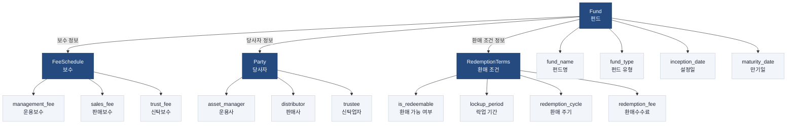
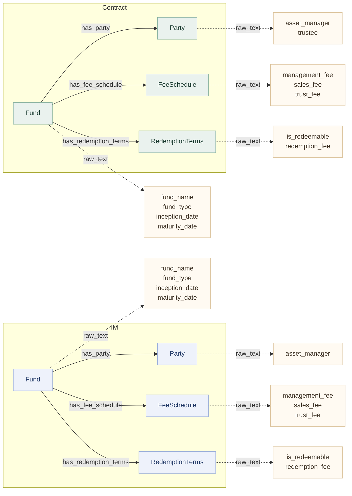

# Ontology Mermaid Diagrams

## Schema

```mermaid
flowchart TD
  Fund[Fund<br/>펀드]
  Party[Party<br/>당사자]
  FeeSchedule[FeeSchedule<br/>보수]
  RedemptionTerms[RedemptionTerms<br/>환매 조건]
  Fund -->|보수 정보| FeeSchedule
  Fund -->|당사자 정보| Party
  Fund -->|환매 조건 정보| RedemptionTerms
  Party --> asset_manager[asset_manager<br/>운용사]
  Party --> distributor[distributor<br/>판매사]
  Fund --> fund_name[fund_name<br/>펀드명]
  Fund --> fund_type[fund_type<br/>펀드 유형]
  Fund --> inception_date[inception_date<br/>설정일]
  RedemptionTerms --> is_redeemable[is_redeemable<br/>환매 가능 여부]
  RedemptionTerms --> lockup_period[lockup_period<br/>락업 기간]
  FeeSchedule --> management_fee[management_fee<br/>운용보수]
  Fund --> maturity_date[maturity_date<br/>만기일]
  RedemptionTerms --> redemption_cycle[redemption_cycle<br/>환매 주기]
  RedemptionTerms --> redemption_fee[redemption_fee<br/>환매수수료]
  FeeSchedule --> sales_fee[sales_fee<br/>판매보수]
  FeeSchedule --> trust_fee[trust_fee<br/>신탁보수]
  Party --> trustee[trustee<br/>신탁업자]
  classDef classNode fill:#244a7f,color:#fff,stroke:#18365e,stroke-width:1px
  classDef propertyNode fill:#f2f5fa,color:#1f2633,stroke:#c7d0de,stroke-width:1px
  class Fund,Party,FeeSchedule,RedemptionTerms classNode
  class asset_manager,distributor,fund_name,fund_type,inception_date,is_redeemable,lockup_period,management_fee,maturity_date,redemption_cycle,redemption_fee,sales_fee,trust_fee,trustee propertyNode
```

## ABox

```mermaid
flowchart LR
  subgraph Contract[Contract]
    fund_contract[Fund]
    party_contract[Party]
    fee_schedule_contract[FeeSchedule]
    redemption_terms_contract[RedemptionTerms]
  end
  subgraph IM[IM]
    fund_im[Fund]
    party_im[Party]
    fee_schedule_im[FeeSchedule]
    redemption_terms_im[RedemptionTerms]
  end
  fund_contract -->|has_party| party_contract
  fund_contract -->|has_fee_schedule| fee_schedule_contract
  fund_contract -->|has_redemption_terms| redemption_terms_contract
  fund_im -->|has_party| party_im
  fund_im -->|has_fee_schedule| fee_schedule_im
  fund_im -->|has_redemption_terms| redemption_terms_im
  fund_contract -. raw_text .-> fund_contract_fields[fund_name<br/>fund_type<br/>inception_date<br/>maturity_date]
  party_contract -. raw_text .-> party_contract_fields[asset_manager<br/>trustee]
  fee_schedule_contract -. raw_text .-> fee_schedule_contract_fields[management_fee<br/>sales_fee<br/>trust_fee]
  redemption_terms_contract -. raw_text .-> redemption_terms_contract_fields[is_redeemable<br/>redemption_fee]
  fund_im -. raw_text .-> fund_im_fields[fund_name<br/>fund_type<br/>inception_date<br/>maturity_date]
  party_im -. raw_text .-> party_im_fields[asset_manager]
  fee_schedule_im -. raw_text .-> fee_schedule_im_fields[management_fee<br/>sales_fee<br/>trust_fee]
  redemption_terms_im -. raw_text .-> redemption_terms_im_fields[is_redeemable<br/>redemption_fee]
  classDef contract fill:#eaf2ee,color:#1f3f34,stroke:#8bb3a2,stroke-width:1px
  classDef im fill:#eef2fb,color:#253c69,stroke:#9aaeda,stroke-width:1px
  classDef fields fill:#fffaf2,color:#3f3326,stroke:#dbc39c,stroke-width:1px
  class fund_contract,party_contract,fee_schedule_contract,redemption_terms_contract contract
  class fund_im,party_im,fee_schedule_im,redemption_terms_im im
  class fee_schedule_contract_fields,fee_schedule_im_fields,fund_contract_fields,fund_im_fields,party_contract_fields,party_im_fields,redemption_terms_contract_fields,redemption_terms_im_fields fields
```
